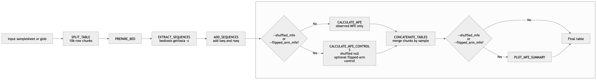

# Chimeric Interaction Sequence Extraction and MFE Computation Pipeline

## This Nextflow pipeline processes chimeric interaction tables by:
1. Splitting large tables into 10k row chunks (preserving headers)
2. Extracting FASTA sequences for left and right coordinates using bedtools
3. Adding extracted sequences as new columns (lseq, rseq)
4. Performing MFE calculation on the extracted sequences ([RNAduplex](https://www.tbi.univie.ac.at/RNA/ViennaRNA/doc/html/man/RNAduplex.html))
5. Optionally generating shuffled control sequences for MFE comparisons ([uShuffle](https://link.springer.com/article/10.1186/1471-2105-9-192)) and/or flipped arm control (reversing one arm's sequence)
6. Concatenating all chunks back into a single table with one header and plotting



## Requirements

- Nextflow >= 25.10.2
- Docker or Singularity

## Quick Start

> Important: we assume BED-style 0-based half-open coordinates are given in the input.

### Option 1: Using a samplesheet

```bash
nextflow run main.nf \
  --input samplesheet.tsv \
  --fasta /path/to/genome.fa \
  --fai /path/to/genome.fa.fai \
  --chunk_size <n> \
  --shuffled_mfe \
  --n_shuffles <n> \
  --flipped_arm_mfe \
  --outdir results
```

**Samplesheet format** (TSV with header):
```
sample_id	file_path
GM12878_rep1	/path/to/GM12878_rep1.chim.txt
GM12878_rep2	/path/to/GM12878_rep2.chim.txt
```

### Option 2: Using a glob pattern

```bash
nextflow run main.nf \
  --input_pattern 'data/*.chim.txt' \
  --fasta /path/to/genome.fa \
  --outdir results \
  <...>
```

## Parameters

### Required
- `--fasta`: Path to reference genome FASTA file
- `--fai`: Path to reference genome FASTA index

### Input (choose one)
- `--input`: Path to samplesheet (TSV format)
- `--input_pattern`: Glob pattern for input files (e.g., "data/*.txt")

### Optional
- `--outdir`: Output directory (default: './results')
- `--chunk_size`: Number of rows per chunk (default: 10000)
- `--shuffled_mfe`: Enable MFE calculations for shuffled control sequences (default: false)
- `--n_shuffles`: Number of times the sequence is shuffled (default: 100)
- `--klet_shuffles`: klet for sequence shuffling (default: 2)
- `--flipped_arm_mfe`: Enable MFE calculations for flipped arm control sequences

## Input File Format

Input files should be tab-delimited with the following required columns:
```
lchr	ll	lr	lstrand	rchr	rl	rr	rstrand	name
```

Optional columns:
```
mapq
```

## Output

For each sample, the pipeline produces:
- `{sample_id}_mfe.tsv`: Final table with added columns

Output columns include all original columns plus:
- `lseq`: Extracted sequence for left coordinate (strand-aware)
- `rseq`: Extracted sequence for right coordinate (strand-aware)
- `mfe` : Observed minimum free energy, MFE (kcal/mol)
- `dot_bracket`: Dot-bracket representation of the predicted duplex structure for the observed lseq and rseq

- `mean_shuffled_mfe`: Mean duplex MFE across all successfully evaluated shuffled sequence pairs
- `sd_shuffled_mfe`: Standard deviation of duplex MFE across all successfully evaluated shuffled sequence pairs
- `delta_mfe`: Observed MFE minus the mean shuffled MFE
- `zscore_mfe`: Standardized difference between the observed MFE and the shuffled MFE distribution
- `empirical_p_lower`: Empirical one-sided p-value for observing an MFE this low or lower relative to the shuffled null distribution
- `n_shuffles_ok`: Number of shuffled sequence pairs for which duplex MFE was successfully computed

- `mfe_lseq_flipped`: Duplex MFE after reversing lseq only and folding it against the original rseq
- `flipped_lseq_dot_bracket`: Dot-bracket structure for the duplex formed by reversed lseq and original rseq
- `flipped_lseq_pair`: The exact sequence pair used for that fold, formatted as `reversed_lseq&original_rseq`
- `mfe_rseq_flipped`: Duplex MFE after reversing rseq only and folding it against the original lseq
- `flipped_rseq_dot_bracket`: Dot-bracket structure for the duplex formed by original lseq and reversed rseq
- `flipped_rseq_pair`: The exact sequence pair used for that fold, formatted as original_lseq&reversed_rseq


## Execution Profiles

### Docker
```bash
nextflow run main.nf -profile docker --input ... --fasta ...
```

### Singularity
```bash
nextflow run main.nf -profile singularity --input ... --fasta ...
```


## Pipeline Overview

```
Input Tables
    ↓
SPLIT_TABLE (10k rows per chunk)
    ↓
PREPARE_BED (convert to BED format)
    ↓
EXTRACT_SEQUENCES (bedtools getfasta -s)
    ↓
ADD_SEQUENCES (add lseq, rseq columns)
    ↓
CALCULATE_MFE or CALCULATE_MFE_CONTROLS (MFE-related columns)
    ↓
CONCATENATE_TABLES (merge chunks)
    ↓
PLOT_MFE_SUMMARY (per sample)
    ↓
Final Output
```

## Example

```bash
# Using samplesheet
nextflow run main.nf \
  --input samplesheet.tsv \
  --fasta hg38.fa \
  --chunk_size 10000 \
  --outdir results \
  -profile docker
```

## rRNA Structure Distance Maps

This repository also includes a standalone helper script,
`nc_rna_benchmarking/rrna_dist.py`, for turning a ribosome structure file into
rRNA physical distance matrices and quick-look plots. This is separate from the
Nextflow MFE pipeline above: it is for benchmarking interaction/contact signals
against the 3D geometry of modelled rRNA chains.

### Setup

Create the local environment:

```bash
conda env create -f nc_rna_benchmarking/environment.yml
conda activate nc-rna-benchmarking
```

Download a ribosome structure from the PDB in mmCIF format, for example:

```bash
curl -O https://files.rcsb.org/download/6EK0.cif
```

Run the script:

```bash
python nc_rna_benchmarking/rrna_dist.py 6EK0.cif
```

By default, outputs are written to `rrna_dist_outputs/`, which is ignored by
Git. The default bin sizes are `1,8,16,64,128` nt:

```bash
python nc_rna_benchmarking/rrna_dist.py 6EK0.cif --bins 1,8,16,64,128
```

Useful options:

```bash
# Write somewhere else
python nc_rna_benchmarking/rrna_dist.py 6EK0.cif --outdir dist_6EK0

# Use phosphate positions instead of C1' positions
python nc_rna_benchmarking/rrna_dist.py 6EK0.cif --atom P

# Skip PNG generation and only write arrays/tables
python nc_rna_benchmarking/rrna_dist.py 6EK0.cif --no-plots
```

### Outputs

The output root contains one FASTA file per detected rRNA chain:

```text
rrna_dist_outputs/
  28S_chainX.fa
  18S_chainY.fa
  rrna_dist.log
  bin_001nt/
  bin_008nt/
  bin_016nt/
  bin_064nt/
  bin_128nt/
```

Each `bin_*nt/` directory contains one set of files per chain:

- `*.dist.npy`: physical distance matrix in Angstroms
- `*.xyz.npy`: coordinate array used for plotting that bin resolution
- `*.bins.tsv`: mapping from matrix row to polymer `seq_id` and deposited residue-number window
- `*.distance_map.png`: heatmap of pairwise physical distances
- `*.structure_trace.png`: 3D trace plot of the modelled chain

The root-level FASTA is intentionally not repeated inside binned folders. At
coarse resolutions, a matrix row represents a residue window rather than one
nucleotide, so `*.bins.tsv` is the authoritative row mapping for binned outputs.

### Methodology

The script reads the first model from a structure file using
[`gemmi`](https://gemmi.readthedocs.io/), then keeps chains with at least
`--min-len` nucleotide-like residues. A residue is treated as RNA if it has a
`C1'` atom, which also captures many modified bases. Chains are labelled as
`28S`, `18S`, `5.8S`, `5S`, or `other` using the full polymer span from the
mmCIF sequence scheme when available, or the residue-number span as a fallback.
This matters because cryo-EM ribosome models often omit disordered expansion
segments; the full chain span is usually a better proxy for the mature rRNA
identity than the count of observed residues.

Use `.cif`/mmCIF input when possible. Classic `.pdb` files may be readable, but
they do not carry `_pdbx_poly_seq_scheme`, so the script must fall back to
numeric residue-ID inference for the sequence axis.

For the nucleotide-level matrix (`bin_001nt`), each residue is represented by
one coordinate. The default is the ribose `C1'` atom because it is present in
standard and modified RNA residues and gives a stable per-nucleotide anchor
near the base. `--atom P` can be used if phosphate-backbone distances are more
appropriate for a given analysis. `--atom centroid` uses the average position
of all atoms in each residue, but this should be interpreted as a display or
coarse geometric summary rather than a direct contact definition.

For mmCIF inputs, missing and modelled positions are taken from
`_pdbx_poly_seq_scheme`, the PDB table that maps the full polymer sequence
(`seq_id`) to the deposited/modelled residue numbering. That is more reliable
than inferring gaps from numeric residue IDs alone, especially for structures
with unusual numbering or insertion codes. If the table is not present, the
script falls back to the older contiguous numeric-residue inference. In both
cases, unmodelled positions have `NaN` coordinates. Matplotlib uses those
`NaN`s to break the 3D trace line, so the plot does not draw fake backbone
chords across missing segments.

For coarse bins such as 8, 16, 64, and 128 nt, the distance matrix is not
computed from centroid-to-centroid distances. Large windows can span separate
structural domains, so their centroid may sit in empty solvent and imply a
distance that does not correspond to any nucleotide pair. Instead, the script
first computes the nucleotide-level distance matrix once and then block-reduces
each pair of windows with a minimum distance. In other words, a binned matrix
entry answers: "what is the closest modelled nucleotide pair between window i
and window j?" This is a better denominator for contact-style benchmarking.

Centroid coordinates are still written as `*.xyz.npy` for binned resolutions
because they are useful for quick-look 3D trace plots and visual summaries.
They should not be treated as the source of the coarse-bin contact distances.

### KARR-seq-Compatible Variant

`nc_rna_benchmarking/rrna_dist_karrseq.py` is a related script for reproducing
the style of rRNA structure benchmark used by KARR-seq. It has the same broad
purpose as `rrna_dist.py`: read a ribosome structure, extract rRNA chains, and
write distance matrices plus sequence/row-mapping files. The difference is that
it exposes the windowing and reduction choices explicitly, including a
`--karr-seq` preset.

Run it with:

```bash
python nc_rna_benchmarking/rrna_dist_karrseq.py 4V6X.cif --karr-seq
```

The KARR-seq preset expands to:

```bash
--bins 1,5 --atom centroid --centroid-weight atom --reduce centroid
```

This means:

- rRNA is split into 5-nt windows, plus an unbinned 1-nt output.
- Each window is represented by the centroid of its modelled atoms.
- Window-window distances are Euclidean distances between those centroids.
- Atom-weighted centroids are used, matching the KARR-seq convention where
  residues with more atoms contribute slightly more to the window centroid.

The script docstring notes `4V6X` as the structure to use for direct comparison
with the published KARR-seq rRNA benchmark. Newer structures such as `6EK0` may
be better resolved, but they are not the same benchmark reference.

Additional modes:

```bash
# KARR-seq-style centroid distances, but with custom bins
python nc_rna_benchmarking/rrna_dist_karrseq.py 4V6X.cif \
  --bins 1,5,10 \
  --atom centroid \
  --reduce centroid

# Closest nucleotide pair between each pair of windows
python nc_rna_benchmarking/rrna_dist_karrseq.py 4V6X.cif \
  --bins 1,8,16,64,128 \
  --atom "C1'" \
  --reduce min

# Fraction of modelled nucleotide pairs below a contact threshold
python nc_rna_benchmarking/rrna_dist_karrseq.py 4V6X.cif \
  --bins 5 \
  --reduce contact \
  --contact-cutoff 16
```

The reduction modes answer different biological/computational questions:

- `centroid`: distance between window centroids. This matches KARR-seq and is
  reasonable for small compact windows, especially 5 nt. It becomes harder to
  interpret for large windows because the centroid may fall between domains or
  in solvent.
- `min`: closest nucleotide pair between two windows. This asks whether any
  part of two regions comes close, which is useful for contact-style
  denominators, but values are not directly comparable across bin sizes because
  larger bins contain more possible nucleotide pairs.
- `contact`: fraction of modelled nucleotide pairs below `--contact-cutoff`.
  This is closer to a contact-density interpretation and normalises by the
  number of modelled pairs, which helps with partially missing windows.

`rrna_dist_karrseq.py` also writes `*.lookup.tsv` in each bin directory. That
file maps each polymer `seq_id` / deposited residue label to the matrix row for
that bin, which is useful when mapping chimeric-read arm midpoints onto the
structure matrix.

## Notes to self

### Settings for local testing
`conda activate nfcore_tools_34`

```
nextflow run main.nf --fasta /Volumes/lab-ulej/home/users/luscomben/users/iosubi/projects/structurome_blencowe/ref/Homo_sapiens.GRCh38.dna.primary_assembly.fa --input ./data/samplesheet.tsv --outdir results -profile docker --chunk_size 10 -resume --fai /Volumes/lab-ulej/home/users/luscomben/users/iosubi/projects/structurome_blencowe/ref/Homo_sapiens.GRCh38.dna.primary_assembly.fa.fai --shuffled_mfe --n_shuffles 5 --flipped_arm_mfe
```

#### Data flow with chunk matching
```
SPLIT_TABLE → [meta, chunk_0001.txt]
              [meta, chunk_0002.txt]
              [meta, chunk_0003.txt]
                     ↓
PREPARE_BED → [meta, chunk_0001.txt, chunk_0001_left.bed, chunk_0001_right.bed]
              [meta, chunk_0002.txt, chunk_0002_left.bed, chunk_0002_right.bed]
              [meta, chunk_0003.txt, chunk_0003_left.bed, chunk_0003_right.bed]
                     ↓
EXTRACT_SEQUENCES → [meta, chunk_0001.txt, left.fa, right.fa]
                    [meta, chunk_0002.txt, left.fa, right.fa]
                    [meta, chunk_0003.txt, left.fa, right.fa]
                     ↓
ADD_SEQUENCES → [meta, chunk_0001_sequences.tsv]
                [meta, chunk_0002_sequences.tsv]
                [meta, chunk_0003_sequences.tsv]

etc.
```
